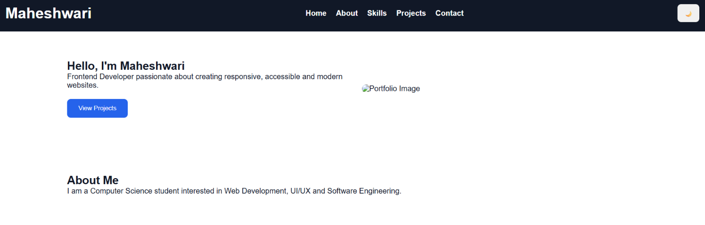
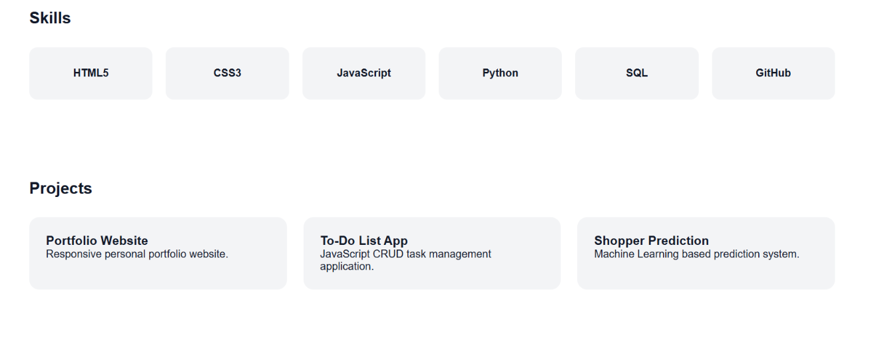

# 💼 Responsive Portfolio Website

A modern and responsive portfolio website designed to showcase my skills, projects, education, and contact information.

## 🚀 Live Demo

🔗 https://lucky-chebakia-6d5d4f.netlify.app/

## ✨ Features

- Fully responsive design
- Modern and clean UI
- About Me section
- Skills showcase
- Project portfolio section
- Contact information section
- Smooth navigation
- Mobile-friendly layout

## 🛠️ Technologies Used

- HTML5
- CSS3
- JavaScript

## 📁 Project Structure

├── index.html
├── style.css
├── script.js
├── images/

## 📸 Screenshots

### Home Page

### Projects Section

## 🔮 Future Enhancements

- Dark mode support
- Resume download feature
- Contact form integration
- Blog section
- Project filtering options
- Animations and transitions

## 👩‍💻 Author

Kanneboina Maheshwari

GitHub: https://github.com/KanneboinaMaheshwari29/